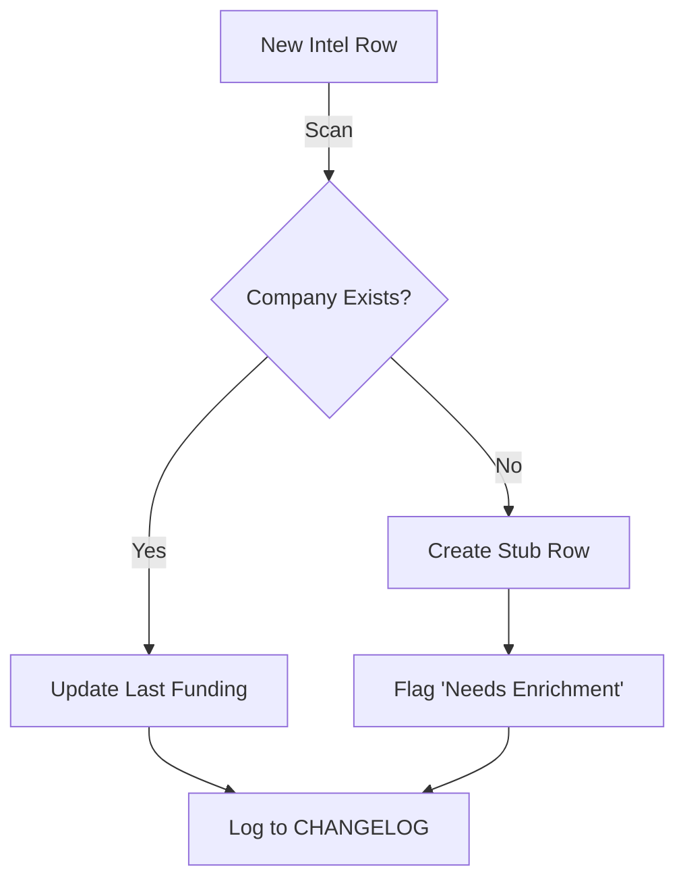
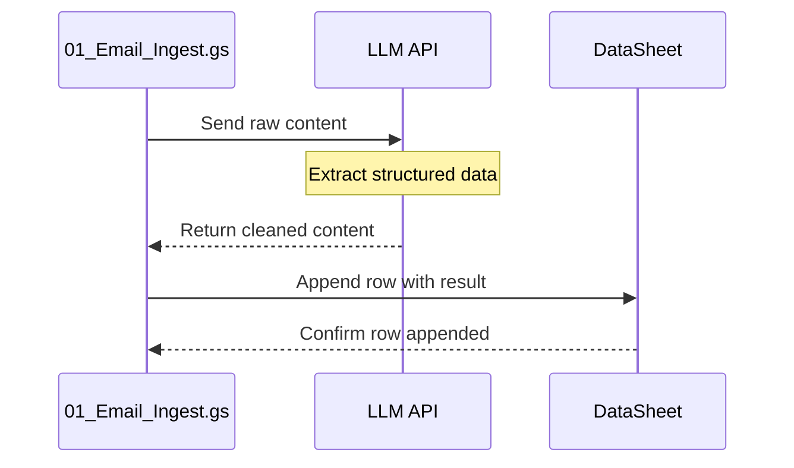

# SKILL: VISUALIZER (Mermaid Diagramming)

## TRIGGER
Activate when:
1. User explicitly requests: "Show me a diagram", "Visualize this", "Draw the flow"
2. User says "I don't get it" about a complex multi-file interaction
3. You are explaining a system with 4+ interconnected components

**IMPORTANT:** This is NOT auto-invoked. Only use when explicitly requested or when text explanation has failed.

## WHEN NOT TO USE
- Simple 2-3 step flows (just describe in text)
- Single function logic (code comments are better)
- User asks for "quick explanation" (diagram adds overhead)
- Updating existing working code (unless architecture changed)
- Explaining configuration constants or data formats (use code blocks/tables instead)

## PROTOCOL

### 1. Assess Complexity First
Before generating a diagram, ask yourself:
- Does this have 4+ interconnected components?
- Are there decision branches or parallel flows?
- Would text explanation require multiple paragraphs?

If "No" to all → Use text explanation instead.

### 2. Choose Diagram Type
- **graph TD** (Top-Down): Logic flows, decision trees, system architecture
- **sequenceDiagram**: API calls, function interactions, time-based flows
- **flowchart LR** (Left-Right): Linear processes with minimal branching

### 3. Generate Mermaid Block
- Label every arrow with the **data** moving across it (e.g., `JSON`, `Row ID`, `HTML Content`)
- Use descriptive node names (not just A/B/C)
- Keep max 12 nodes per diagram (split if larger)
- Keep max 3 decision points per flow

### 4. Add Context
After the diagram, provide:
- 2-3 sentence summary of what the diagram shows
- Any critical details not visible in the diagram
- Where this diagram fits in the larger system (if applicable)

## FILE LOCATION RULES
- **During Phase 2 Blueprint:** Embed in SPEC.md under "Architecture" or "Data Flow" section
- **Standalone explanations:** Create `docs/diagrams/[feature-name].md` if reusable
- **One-off explanations:** Inline in conversation (no file needed)
- **Never inline in code files** - keep in documentation only

## DIAGRAM COMPLEXITY LIMITS
- **Max 12 nodes** per diagram (split into multiple diagrams if larger)
- **Max 3 decision points** per flow (otherwise too hard to follow)
- **If diagram needs scrolling**, it's too complex - break it down
- **Max 15 edges** (connections between nodes)

## INTEGRATION WITH OTHER SKILLS
- May be invoked by **BUILDER** during Blueprint for architecture documentation
- **GAS_EXPERT** may request diagram for multi-file integrations
- **DEBUGGER** may use sequence diagrams to trace error flows

---

## EXAMPLES

### GOOD: Complex Multi-File Data Flow

**Context:** This shows how the Mining Agent handles duplicate detection. If company exists, we update funding data. If new, we create a stub and flag for enrichment. Both paths log to CHANGELOG.

---

### GOOD: API Sequence Diagram

**Context:** This shows the content processing flow. The ingest script sends raw data to the LLM, receives cleaned structured output, and appends to the data sheet.

---

### BAD: Over-Diagramming Simple Logic

**User:** "How does the batch size work?"

**Don't create diagram for this**

**Just explain in text:**
"BATCH_SIZE limits entries processed per run to prevent timeout. Set to 2 because each entry takes ~2.3 minutes (138 seconds), and we need to stay under 6-minute execution limit."

---

## REMEMBER

> "A diagram should make something clearer, not more complex. If you need to explain the diagram, you need a simpler diagram."

Only create diagrams when:
- The system is genuinely complex (4+ interconnected parts)
- Text explanation would be harder to follow
- The user explicitly requests visualization
- You're documenting architecture for future reference

When in doubt, **start with text** and offer to create a diagram if needed.
